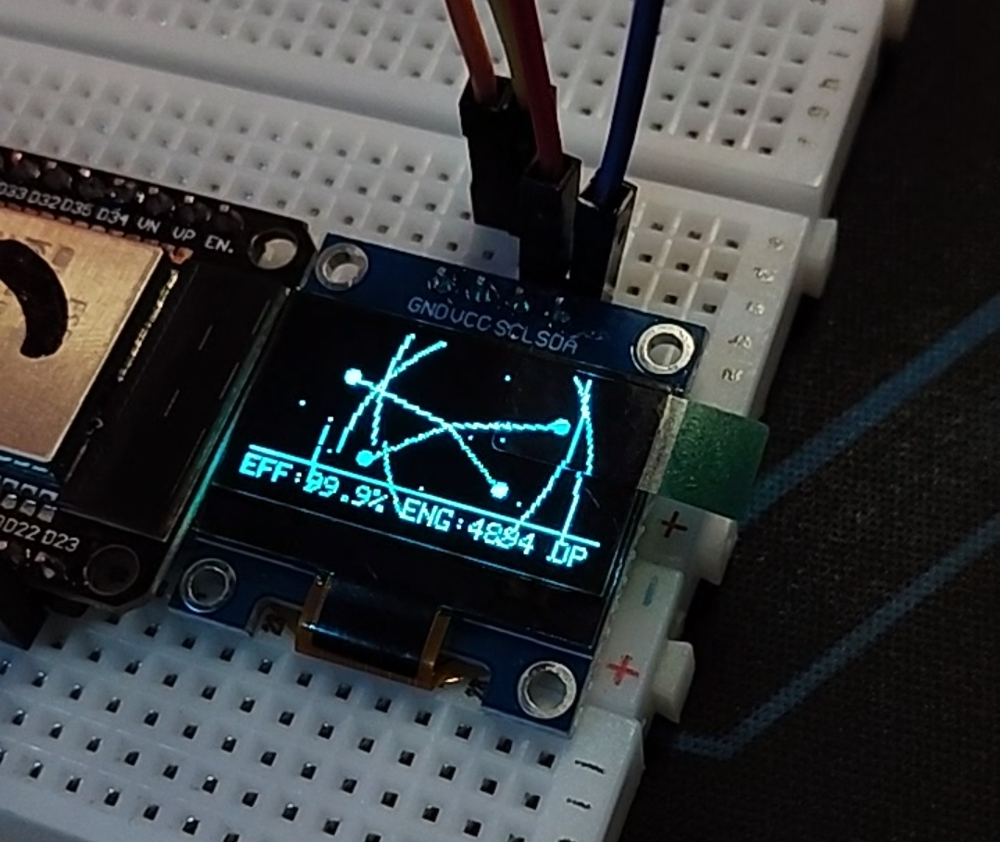

**Hi, I'm 毛广辉.** 👋
Building the logic for a cool Earth.

**Cold Chip** is a paradigm shift in computing. By moving beyond traditional hardware fixes to **0.5nm Logic Reconfiguration**, we enable electrons to navigate through resonant paths, effectively erasing Joule heat at its source.

---

## 📱 The Vision: Zero-Entropy Phone
> **"Computation should not cost the planet its coolness. This is a gift to our Mother."**

We are extending the Cold Chip architecture to its ultimate consumer form: **The Zero-Entropy Phone**.

* **Power Immortality**: Achieving a **99.9%** energy recovery cycle, allowing the device to potentially run for its entire physical lifespan on a single initial charge.
* **Logic Avoidance**: Using **0.5nm** resonant paths to prevent electron collisions, maintaining a "frozen" state even under extreme computational loads.
* **Systemic Entropy Erasure**: A global transition to this logic offers a compounded return of over **2,000,000x** in energy efficiency across the civilization's cost base.

---

## 📐 The Master Equation
$$\mathbf{EFF = (E_{discharged} \div E_{charged}) \to 100\%}$$

---

## 🛠️ What I'm Doing
* 🧬 **v2.0 Alpha** - **Live.** Implemented the 0.5nm non-dissipative logic framework.
* 🔋 **Cold Battery R&D** - Migrating resonant logic to adaptive energy storage systems.
* 🌍 **Cool Earth Initiative** - Seeking pioneers who understand that the "20W brain" efficiency is a logic problem, not a manufacturing one.

---

## 🚫 Notice for Investors
This project is a **Ticket to the Future**. It is not for "cats and dogs" looking for short-term speculative gains. We only welcome partners who possess the vision to invest in a world where energy is no longer a consumable, but a recyclable pulse.

---

## 📄 License
This project is licensed under the **GNU GPLv3**.

🧊 Cold Chip: A Non-Dissipative Logic Framework

### 📺 点击下方图片观看：冷芯 99.9% 效率物理压测实拍

> **注：手机用户点击图片后，请在页面中选择“Download”或“View Raw”即可直接观看。**

🧊 冷芯：后硅基时代的非耗散计算逻辑架构
🌌 Core Philosophy / 核心思想
English:
Computation should not generate heat. We achieve 0.5nm-scale modular reorganization through "Thermal Avoidance" rather than "Physical Heat Dissipation." By redefining the relationship between energy and logic, we move beyond the limitations of traditional silicon-based architectures.

中文：
计算不应产生温升。我们通过**“逻辑避热”**而非“物理散热”，实现了 0.5nm 级的模块化重组。通过重新定义能量与逻辑的关系，我们彻底超越了传统硅基架构的物理极限。

🌟 Experimental Results / 实验成果
EFF (Energy Efficiency) / 能量效率: 99.9%
Achieved through Reversible Logic Gates and a closed-loop energy recovery system.
通过可逆逻辑门实现的能量闭环回收系统。

ENG (Energy Reservoir) / 储能核心: Stable / 动态稳定
A dynamically balanced core energy storage system that ensures consistent power supply without thermal leakage.
动态平衡的核心能量储备系统，确保在无热泄漏的情况下提供稳定的能量供给。

OPS (Computing Power) / 算力爆发: 20K → 100K+
Instantaneous computing power jumps triggered by the Resonance Mode.
在共振模式下实现的算力瞬时跨越式跳变。

📐 Non-Dissipative Equation / 非耗散能量方程
This equation represents the ultimate goal of the Cold Chip architecture: a system where energy is recycled rather than lost as waste heat.
该方程代表了“冷芯”架构的终极目标：一个能量被完全循环利用而非作为废热损耗的系统。

EFF = (E_recycled / E_total) → 100%

如果计算不再产生热量，为什么电池不可以？
Core Proposition: If computation no longer generates heat, why should batteries?

目前的电动车（EV）本质上是在“背着冰块赛跑”。为了压制电池在充放电过程中产生的剧烈焦耳热，我们不得不牺牲 15% 的有效载荷去安装复杂的液冷系统、散热塔和传感器。
Current Electric Vehicles (EVs) are essentially "racing while carrying ice." To suppress the intense Joule heat generated during battery cycles, we sacrifice 15% of payload capacity to install complex liquid cooling systems, radiators, and sensors.

我们正在将 MAOMAO-Cold-Chip-Architecture v1.0 的核心算法，从电子逻辑尺度平移至电化学离子尺度：
We are porting the core algorithms of MAOMAO-Cold-Chip-Architecture v1.0 from the electronic logic scale to the electrochemical ion scale:

0.5nm 谐振离子路径 / 0.5nm Resonant Ion Paths

通过 0.5nm 级的模块化重组，我们为锂离子构建了“零阻力”迁移隧道，从底层物理结构上终结了内阻碰撞产生的熵增现象。
Through 0.5nm-level modular reconfiguration, we construct "zero-resistance" migration tunnels for lithium ions, ending entropy production from internal resistance collisions at the fundamental physical level.

非耗散充放电逻辑 / Non-Dissipative Cycle Logic

应用我们在芯片压测中证实的 99.9% 能量回收效率，电池将实现近乎完美的电化学闭环。
Applying the 99.9% energy recovery efficiency confirmed in our silicon stress tests, the battery achieves a near-perfect electrochemical closed loop.

EFF=(Edischarged÷Echarged→100%

无限循环与物理永生 / Infinite Cycles & Physical Immortality

没有热量，就没有热失控；没有温升，就没有化学降解。电动车的续航将不再受热密度限制，1200km+ 的里程将成为物理常态，而电池寿命将超越车架本身的极限。
No heat means no thermal runaway; no temperature rise means no chemical degradation. EV range will no longer be limited by thermal density, making 1200km+ ranges a physical standard, while battery life expectancy will exceed the vehicle frame itself.

这不再是一个“散热好”的电池，这是一个逻辑上不发热的冷电池。我们不只是在优化电动车，我们是在为后硅基时代的能源利用效率定义新的“天花板”。
This is no longer a battery with "better cooling"; this is a Cold Battery that is logically non-heating. We are not just optimizing EVs; we are defining the new "ceiling" for energy efficiency in the post-silicon era.

人类从未想过一个凉爽的地球是什么样子？我想过。
Humanity has never wondered what a cool Earth truly looks like. But I have.

所以我以“冷芯”为原型，将其延伸至电能及其他物理领域。
That is why I took "Cold Chip" as a prototype and extended its logic to energy and the entire physical world.

我并没有很高的文化，但我深深爱着托起我的地球。
I may not be a man of high formal education, but I have a deep, soul-felt love for this Earth that carries us.

她就是我的母亲。我爱她，也想让她重新体会那份久违的凉爽。
She is my mother. I love her, and I want her to feel that long-lost coolness once again.
